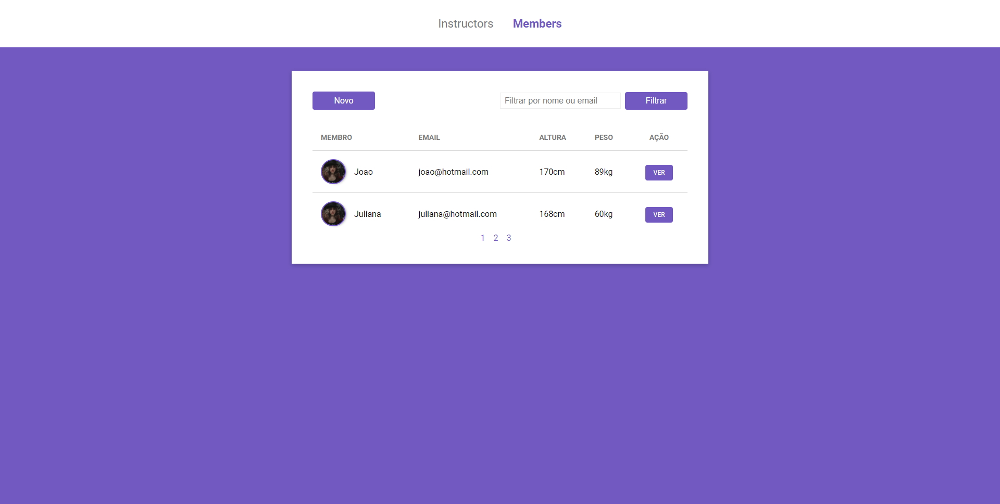
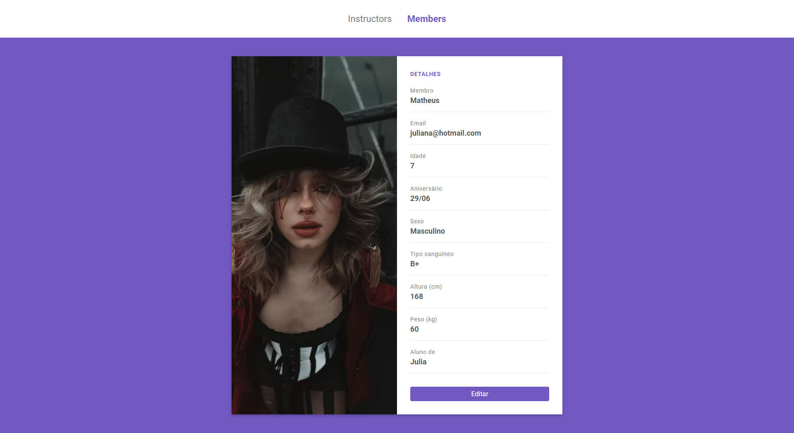

# Gym manager


## 📝 Sobre

**Gym manager** é um controlador de uma academia, que permite criar/editar/deletar/filtrar instrutores e alunos


---------

## 🖥️ Demonstração

<h1>
     

<h1>
     

<h1>
     

<h1>
     


----------


## 🚀 Tecnologias e ferramentas utilizadas

- **HTML5**
- **CSS3**
- **JavaScript**
- **NodeJS**
- **PostgreeSQL**
- **Nunjucks**
- **Method override**
- **Express**

---------

## 💻 Instalação e uso

```bash
# Abra um terminal e copie este repositório com o comando
$ git clone https://github.com/RodrigoFonsecaG/gym-manager.git
# ou use a opção de download.

# Entre na pasta do projeto 
$ cd academia

# Instale as dependências
$ npm install

# Rode o aplicação
$ npm start

#Por fim acesse o localhost:3000 no seu navegador.
```

-----------
